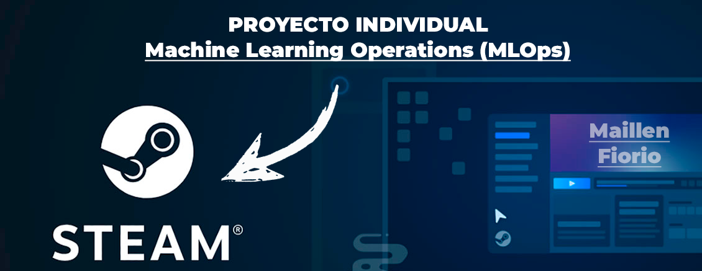

# HENRY LABS: Proyecto Individual N°1

## Descripción General del Proyecto

Se ha desarrollado el presente proyecto, el cual consiste principalmente en desplegar un sistema de recomendación de videojuegos para usuarios de la plataforma Steam como así también el desarrollo de algunas consultas mediante diversas funciones. El mismo intenta abarcar todas las fases de un proyecto de Machine Learning, desde la transformación de los datos y su preparación para el despliegue de una API mediante FastAPI y a través Render poder alojarlo.

**`Plataforma Web`**: **[link a STEAM]( https://store.steampowered.com/?l=spanish)**

## Base de Datos (Datasets)

Para el despliegue del mismo se han utilizado 3 datasets proporcionados por HENRY.
- DataSets: **[Enlace a Drive](https://drive.google.com/drive/folders/1HqBG2-sUkz_R3h1dZU5F2uAzpRn7BSpj)**

Los mismos se encuentran en formato JSON :
- **`users_items.json`**: El archivo contiene parte de la información sobre usuarios, sus juegos y las horas de  juego en cada uno de ellos.
- **`steam_games.json`**: El archivo contiene la información de los juegos de Steam, y algunos de sus datos, entre ellos nombre, id, género, precio, desarrollador, etc.
- **`user_reviews.json`**: El archivo contiene información sobre las reseñas de los usuarios y su recomendación.

## Tecnologías y Librerías utilizadas

El proyecto se desarrollo con Python 3.12.4 en Visual Studio Code 1.94.2. 
Las librerías utilizadas en cada etapa son las siguientes:

### Limpieza y Transformación de los datos 
- numpy
- pandas
- gzip
- json
- ast

### Análisis exploratorio de datos (EDA)
- pandas
- numpy
- seaborn
- matplotlib

### NLP - Análisis de sentimiento
- pandas
- textblob
- nltk.sentiment

### Funciones y Modelo de aprendizaje automático
- numpy
- pandas
- ast
- cosine_similarity
- TfidfVectorizer

### API y Render
El desarrollo de la API fue realizado mediante **`FastAPI`** y disponibilizada con la plataforma **`Render`**.

## ETL (Extract - Transform - Load)

Tal como lo indica su nombre, en esta etapa se realizó el proceso de **`extracción, transformación y cargar los datos`** en un formato adecuado para el análisis y el despliegue de funciones y del modelado de aprendizaje. 
El proceso consistió de forma resumida en las siguientes etapas:

- Descarga de los tres dataset y su transformación de JSON a CSV/parquet para su mejor manipulación y análisis de los datos para poder trabajar
- Desanidado de columnas que contenían listas o diccionarios.
   -Desanidado de columna df_user_reviews.reviews
   -Desanidado de columna df_users_items.items

- Se aplicaron transformaciones al archivo Steam_Games:
    - eliminación de columnas no necesarias para el analisis,
    - manejo de vacíos/Nulos/Duplicados, 
    - dar formato correcto a la columna "Price" y manejo de valores no numéricos, 
    - extracción del año de la columna "Release_date", 
    - conversión en texto de la columna "id". 
    - En lo que respecta a la columna genero, se convirtió a formato lista y se reemplazaron los valores faltantes por listas vacías. 
    - Por último se analizaron a modo representativo dos valores outliers (mínimo en fecha, y máximo en precio) y ambos fueron corroborados y confirmados en la web.

- Se aplicaron transformaciones al archivo User_reviews:
    - eliminación de columnas no necesarias para el análisis,
    - manejo de vacíos/Nulos/Duplicados, 
    - conversión en texto de la columna "id". 

- Se aplicaron transformaciones al archivo User_items:
    - eliminación de columnas no necesarias para el analisis,
    - manejo de vacíos/Nulos/Duplicados, 
    - conversión en texto de la columna "id". 
    - conversión a float de la columna "playtime_forever".    
    - se incorporó a este dataset la columna "price" desde Steam_Game.

Como resultado del proceso de ETL, se exportaron tres archivos CSV/Parquet:
steam_post_etl.csv, reviews_post_etl.csv y items_post_etl.csv (a su vez este archivo se exporto en parquet para reducir su tamaño)
Los mismos se encuentran en la carpeta \Bases de datos\Archivos Post ETL

Asimismo en el archivo \Notbooks\ETL.ipynb se puede ver en detalle el trabajo realizado.

## EDA (Exploratory -Data Analysis) 
Se realizó un **`análisis de diferentes variables`** de los tres datasets del proyecto. 
Entre ellas:
- La distribución de los precios de los juegos.
- La frecuencia de los géneros y su realación con los desarrolladores, como asi también la relación precio-genero.
- Se analizaron las especificaciones y su frecuencia.
- La evolución de lanzamientos de juegos a través de los años y su tendencia.
- Análisis de las horas jugadas para cada uno de los Juegos y su top 10.
- La relación existente entre juegos recomendados y análisis de sentimientos, como así también el porcentaje de juegos gratis y pagos según su recomendación.

En el archivo \Notbooks\EDA.ipynb se encuentra el análisis univariable y multivariable realizadp.

## Análisis de sentimiento con NLP

En el dataset user_reviews se incluyen reseñas de juegos hechos por distintos usuarios. 
Se procede a crear la columna 'sentiment_analysis' aplicando análisis de sentimiento con NLP 
Dicha columna tendrá la siguiente escala:
* '0' si es malo, 
* '1' si es neutral 
* '2' si es positivo.
* Nota: De no ser posible este análisis por estar ausente la reseña escrita, debe tomar el valor de 1.

Para ello se desarrolla un análisis sobre dos posibles librerías a utilizar:
* TextBlob  
* VADER (SentimentIntensityAnalyzer) 
Se investigan sus pros y contras, se ejecuta el análisis con ambas los cuales se encuentran en los notbooks dentro de la carpeta \Analisis de Sentimiento.

Se resuelve utilizar como base para el desarrollo del proyecto los resultados arrojados por VADER (SentimentIntensityAnalyzer), ya que tiene en cuenta el lenguaje informal, las intensificaciones, la puntuación y las expresiones sarcásticas, que son comunes en reseñas de jugadores.

Se procede a anexar los resultados obtenidos al archivo Steam dentro de la **`columna 'sentiment_analysis'`**.

## Desarrollo de funciones de consulta
Se desarrollan las 5 funciones que se detallan a continuación:

    - def developer( desarrollador : str ): Cantidad de items y porcentaje de contenido Free por año según empresa desarrolladora. 
        Ejemplo de retorno:
            [{'year': 2014,
            'cantidad_items': 74,
            'cantidad_items_gratuitos_por_año': 0,
            '% Contenido Free': 0.0},
            {'year': 2015,
            'cantidad_items': 80,
            'cantidad_items_gratuitos_por_año': 0,
            '% Contenido Free': 0.0},
            {'year': 2016,
            'cantidad_items': 231,
            'cantidad_items_gratuitos_por_año': 0,
            '% Contenido Free': 0.0},
            {'year': 2017,
            'cantidad_items': 428,
            'cantidad_items_gratuitos_por_año': 4,
            '% Contenido Free': 0.93}]
    
    - def userdata( User_id : str ): Debe devolver cantidad de dinero gastado por el usuario, el porcentaje de recomendación en base a reviews.recommend y cantidad de items. 
        Ejemplo de retorno: 
            {'Id Usuario': 'STEAM0082987612',
            'Dinero gastado': '1209.26 USD',
            '% de recomendación': '85.71%',
            'Cantidad de items': 106}

    - def UserForGenre( genero : str ): Debe devolver el usuario que acumula más horas jugadas para el género dado y una lista de la acumulación de horas jugadas por año de lanzamiento.
        Ejemplo de retorno: 
            {  "Usuario con más horas jugadas para Género Sports": "76561197995725436",
            "Horas jugadas": [
            { "Año": 2012,
            "Horas": 40941 },
            { "Año": 2013,
            "Horas": 79186},
            { "Año": 2014,
            "Horas": 73079}  ]}

    - def best_developer_year( año : int ): Devuelve el top 3 de desarrolladores con juegos MÁS recomendados por usuarios para el año dado. (reviews.recommend = True y comentarios positivos)
        Ejemplo de retorno: 
        {'Puesto 1': 'Smartly Dressed Games',
        'Puesto 2': 'Freejam',
        'Puesto 3': 'Studio Wildcard,Instinct Games,Efecto Studios,Virtual Basement LLC'}

    - def developer_reviews_analysis( desarrolladora : str ): Según el desarrollador, se devuelve un diccionario con el nombre del desarrollador como llave y una lista con la cantidad total de registros de reseñas de usuarios que se encuentren categorizados con un análisis de sentimiento como valor positivo o negativo.
        Ejemplo de retorno: 
        {'Valve' : [Negative = 182, Positive = 278]}

## Modelo de Machine Learning: Sistema de Recomendación

 Se realiza un modelo de machine learning para armar un sistema de recomendación, donde el modelo tiene una relación ítem-ítem, esto es se toma un item, en base a que tan similar esa ese ítem al resto, se recomiendan similares. 
 
Por un lado se realiza un modelo de recomendación basado unicamente en el género del juego:
 El desarrollo del mismo está basado en similitud de género utilizando TF-IDF (Term Frequency-Inverse Document Frequency) y similitud del coseno para recomendar juegos
 Se vectoriza el texto de la columna "géneros" utilizando TF-IDF, lo que permite representar cada juego como un vector numérico basado en los géneros. Posteriormente, se calcula la similitud del coseno entre el juego consultado y el resto de los juegos, y se seleccionan los 5 juegos más similares para recomendar, excluyendo el juego original.

Por otro lado, se realiza conceptualmente el mismo modelo pero no solo basandose en la columna género, sino que se combina con la de especificaciones  para tomar otras características que al usuario podrían importarle a la hora de que se le recomiende un juego, como por ejemplo si es multiplayer o no, si tiene contenido descargable, entre otras.

## Desarrollo API y su disponibilización 

La misma se desarrolla dentro del archivo principal: main.py.
Se disponibilizaron los datos usando el framework FastAPI y su posterior deploy en Render.

Se puede acceder a la misma mediante el siguiente link: [LINK A RENDER](https://pi1-steam-kce0.onrender.com/docs#)

## Video explicativo del proyecto y demostración del resultado de las consultas

Enlace al video en el siguiente link: [VIDEO](https://drive.google.com/drive/folders/1ifawAcFIee6r7KveZ17NYU2xZaeWOw-k?usp=drive_link)

## Datos de contacto

Nombre compelto: Maillen Fiorio Espinasse
Mail: maillenfiorio@gmail.com
Enlace a [LINKEDIN](www.linkedin.com/in/maillen-fiorio-data)
